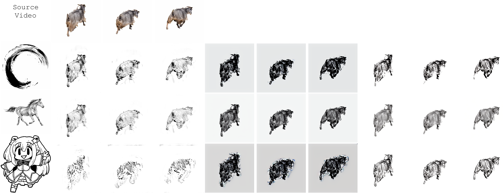
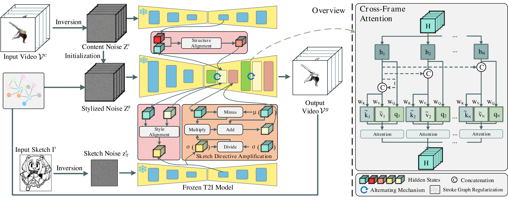

# [WACV 2026 Oral] VideoSketcher: A Training-Free Approach for Coherent Video Sketch Transfer

[[Paper]](#) | [[Project Page]](#)

VideoSketcher, a training-free framework for stylecontrollable
sketch video generation that preserves frame
structure while applying specified sketch aesthetics. Leveraging
text-to-image diffusion models.



## Pipeline

Our proposed method's overall pipeline:



## Setup

### Create a Conda Environment

```bash
conda env create -f environment.yaml
conda activate videosketcher
```

### Download Pre-trained Weights

#### StableDiffusion 
Download the StableDiffusion weights from [stable-diffusion-v1-5 at Hugging Face](https://huggingface.co/stable-diffusion-v1-5/stable-diffusion-v1-5) or your specific SD version.

## Usage

To run the video appearance transfer, execute the main script and pass the path to your configuration file. 

Example running with a dog configuration inversion and reconstruction:
```bash
python3 video_appearance_transfer_model_recon.py --config configs/dog.yaml
```

Example running with a libby configuration video style transfer:
set input_path and app_image_path in the config:
```bash
python3 video_appearance_transfer_model.py --config configs/libby.yaml
```

### Configuration Details

Before running, you need to modify the parameters inside your `.yaml` configuration file. Key parameters include:

* `input_path`: The directory path to your original input video.
* `sd_version`: The specific Stable Diffusion version you are using.
* `model_key`: The local folder path where your downloaded Stable Diffusion model files are saved.
* `app_image_path`: The path to the style reference image.
* `app_image_save_path`: The directory path to store the results after style inversion.

## Acknowledgements

This project is highly built on [Cross-Image-Attention](https://github.com/garibida/Cross-Image-Attention), [StyleID](https://github.com/jiwoogit/StyleID.git), and [Edit-Friendly DDPM Inversion](https://github.com/inbarhub/DDPM_inversion).

## Citation

If you use the code and models please cite:

```bibtex
@inproceedings{li2026videosketcher,
  title={VideoSketcher: A Training-Free Approach for Coherent Video Sketch Transfer},
  author={Li, Huining and Liu, Bangzhen and Yang, Rui and Zhou, Yang and Xu, Chenshu and Pang, Xufang and He, Shengfeng},
  booktitle={Proceedings of the IEEE/CVF Winter Conference on Applications of Computer Vision (WACV)},
  year={2026}
}
```