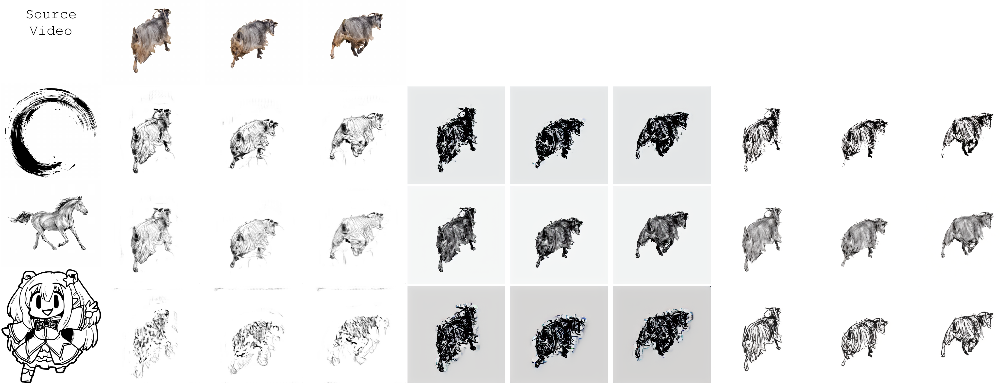
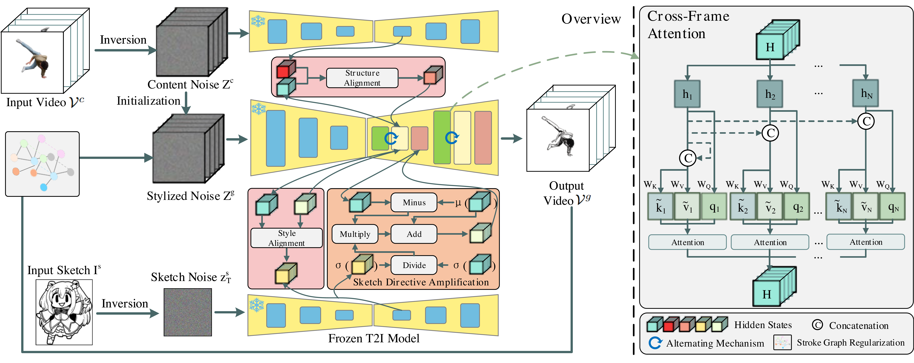

# [WACV 2026 Oral] VideoSketcher: A Training-Free Approach for Coherent Video Sketch Transfer

[[Paper](https://openaccess.thecvf.com/content/WACV2026/papers/Li_VideoSketcher_A_Training-Free_Approach_for_Coherent_Video_Sketch_Transfer_WACV_2026_paper.pdf)] | [[Video]](https://www.youtube.com/watch?v=WwPmkvbpl5k)

VideoSketcher, a training-free framework for stylecontrollable
sketch video generation that preserves frame
structure while applying specified sketch aesthetics. Leveraging
text-to-image diffusion models.



## Pipeline

Our proposed method's overall pipeline:



## Setup

### Create a Conda Environment

```bash
conda create -n videosketcher python=3.8.5
conda activate videosketcher
```

### Install Dependencies

```bash
# Install all dependencies via pip
pip install -r environment/requirements.txt -i http://mirrors.aliyun.com/pypi/simple/ --trusted-host mirrors.aliyun.com

# Download NLTK data
python3 -c "import nltk; nltk.download('punkt'); nltk.download('averaged_perceptron_tagger')"
```

### Download Pre-trained Weights

#### StableDiffusion 
Download the StableDiffusion weights from [stable-diffusion-2-1-base at Hugging Face](https://huggingface.co/Manojb/stable-diffusion-2-1-base) or your specific SD version.

#### CSD Score (for Evaluation)
Download the CSD Score model for style similarity evaluation from [CSD_Score](https://github.com/haofanwang/CSD_Score). Download the pre-trained weights and place them under `./pretrained_models/CSD_Score`:

```bash
mkdir -p ./pretrained_models/CSD_Score
gdown --id 1FX0xs8p-C7Ob-h5Y4cUhTeOepHzXv_46 -O ./pretrained_models/CSD_Score/
```

#### ArtFID (for Evaluation)
Download the ArtFID model for artistic style evaluation. Place the weights under `./pretrained_models/art_fid/`:

```bash
mkdir -p ./pretrained_models/art_fid
wget https://huggingface.co/matthias-wright/art_inception/resolve/main/art_inception.pth -O ./pretrained_models/art_fid/art_inception.pth
```

## Datasets

### Video Datasets
We evaluate our method on the following video datasets:

- **[DAVIS 2017](https://davischallenge.org/)**: Densely Annotated VIdeo Segmentation dataset, used for video object segmentation and style transfer evaluation.
- **[LOVEU-TGVE 2023](https://github.com/showlab/loveu-tgve-2023)**: Long-form Video Editing and Understanding - Track 2: Text-Guided Video Editing, used for text-guided video editing evaluation.

### Style Datasets
- **[4SKST](https://github.com/Chanuku/4skst)**: 4-Sketch Styles dataset, containing diverse sketch styles used as style references for video sketch transfer.
- **[Sketch Style Dataset](https://drive.google.com/file/d/1lB3Hw6tMDA2SYaCy9X7TqTZAvYkRescb/view?usp=drive_link)**: A collection of sketch style images curated from [Pinterest](https://www.pinterest.com/), used as additional style references in this work.

## Usage

### 1. Inversion & Reconstruction (Validation)

Run DDIM inversion and reconstruction to validate latent quality:

```bash
conda activate videosketcher
python3 inversion.py --config configs/kid-football_video.yaml
```

Output paths:
- Video reconstruction: `{work_dir}/{video_name}/latents/recon_frames_batch/`
- Style reconstruction: `{app_image_save_path}/{style_name}/{model_key}/recon_frames/`

### 2. Video Style Transfer

Set `input_path` and `app_image_path` in the config, then run:

```bash
conda activate videosketcher
python3 video_stylize.py --config configs/kid-football_video.yaml
```

Output (under `{work_dir}/{video_name}/{style_name}/`):
| Directory | Content |
|---|---|
| `stylized_frames/` | Final stylized frames + `generated.mp4` |
| `content_recon/` | Content reconstruction frames |
| `style_frames/` | Style result frames |
| `intermediate/` | Per-chunk intermediate outputs |
| `matching_vis/` | Sparse matching visualizations |
| `config.yaml` | Runtime configuration snapshot |

### 3. Evaluation

Compute CLIP temporal consistency, Pixel MSE, FID, LPIPS, and ArtFID:

**Single video+style pair:**
```bash
cd evaluations
python3 evaluate.py \
    --struct /path/to/original/frames \
    --style /path/to/style.jpg \
    --generated /path/to/stylized/frames \
    --frames 10
```

**Batch mode** (multiple pairs from TXT files):
```bash
cd evaluations
python3 evaluate.py \
    --struct-list structs.txt \
    --style-list styles.txt \
    --generated-list generated.txt \
    --frames 10 \
    --output results.csv
```

The TXT files should contain one path per line:

`structs.txt` — original video frame directories:
```
/path/to/video1/imgs_crop_fore
/path/to/video2/imgs_crop_fore
```

`styles.txt` — style reference images:
```
/path/to/style1.jpg
/path/to/style2.jpg
```

`generated.txt` — stylized output directories or .mp4 paths (one per style-video pair):
```
/path/to/video1/style1/stylized_frames
/path/to/video1/style2/stylized_frames
/path/to/video2/style1/stylized_frames
```

**Required pretrained models** (see [Download Pre-trained Weights](#download-pre-trained-weights)):
- CLIP ViT-B/32 (~350MB, auto-cached to `~/.cache/clip/`)
- GMFlow (`pretrained_models/flow/gmflow_sintel-0c07dcb3.pth`)
- Art-Inception (`pretrained_models/art_fid/art_inception.pth`)
- AlexNet (`~/.cache/torch/hub/checkpoints/alexnet-owt-7be5be79.pth`, auto-downloaded by LPIPS)

### Configuration Details

Before running, you need to modify the parameters inside your `.yaml` configuration file. Key parameters include:

* `input_path`: The directory path to your original input video.
* `sd_version`: The specific Stable Diffusion version you are using.
* `model_id`: The local folder path where your downloaded Stable Diffusion model files are saved.
* `app_image_path`: The path to the style reference image.
* `app_image_save_path`: The directory path to store the results after style inversion.

## Acknowledgements

This project is highly built on [Cross-Image-Attention](https://github.com/garibida/Cross-Image-Attention), [StyleID](https://github.com/jiwoogit/StyleID.git), and [Edit-Friendly DDPM Inversion](https://github.com/inbarhub/DDPM_inversion).

## Citation

If you use the code and models please cite:

```bibtex
@inproceedings{li2026videosketcher,
  title={VideoSketcher: A Training-Free Approach for Coherent Video Sketch Transfer},
  author={Li, Huining and Liu, Bangzhen and Yang, Rui and Zhou, Yang and Xu, Chenshu and Pang, Xufang and He, Shengfeng},
  booktitle={Proceedings of the IEEE/CVF Winter Conference on Applications of Computer Vision (WACV)},
  year={2026}
}
```